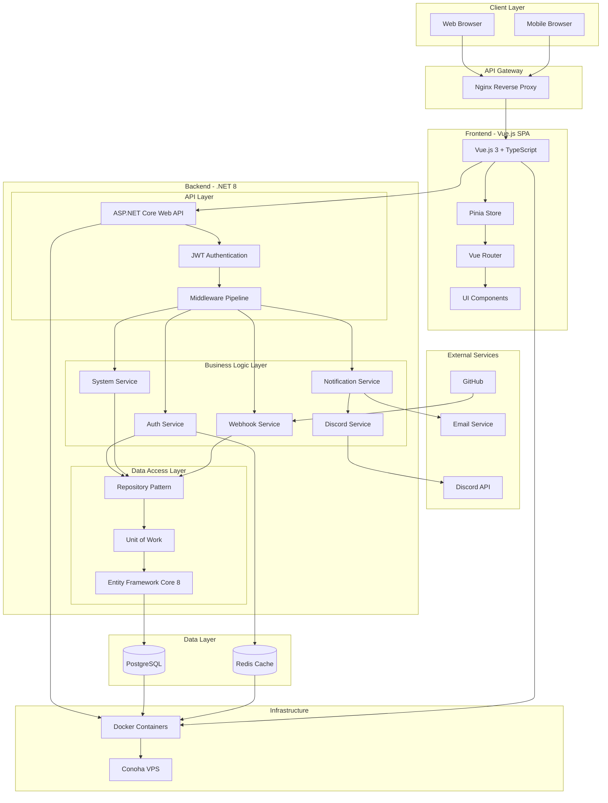
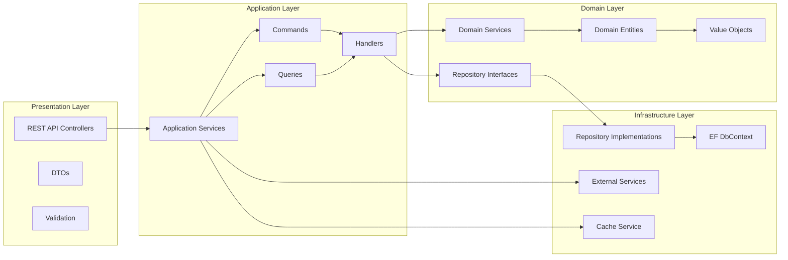
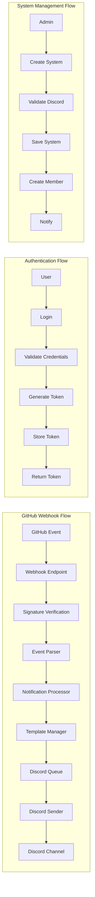
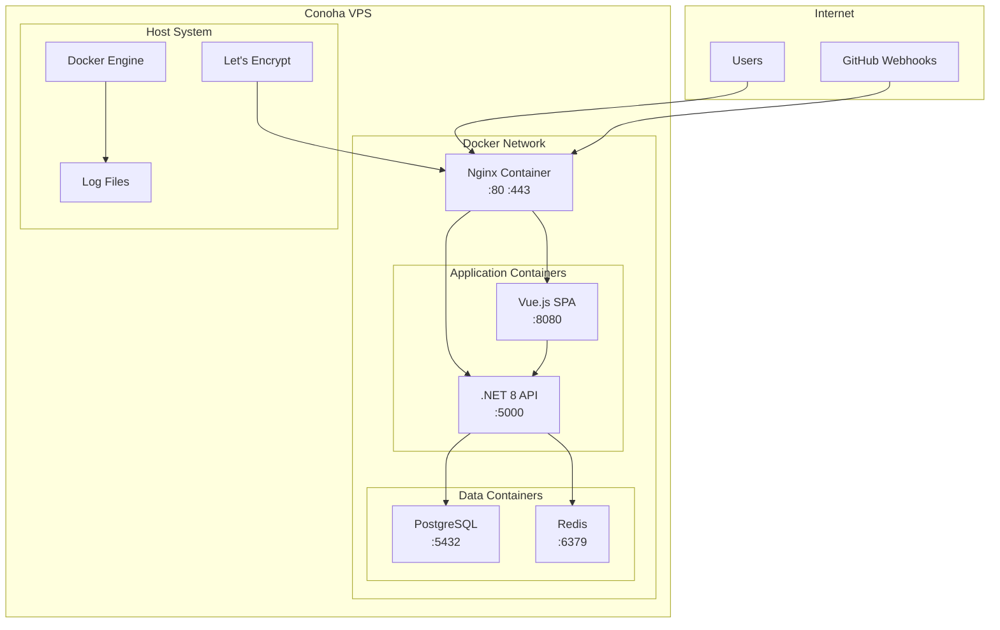
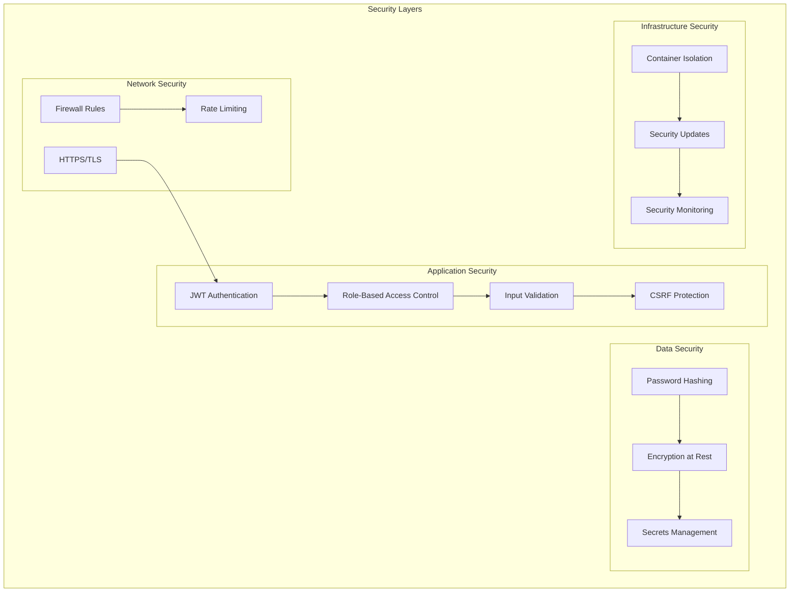
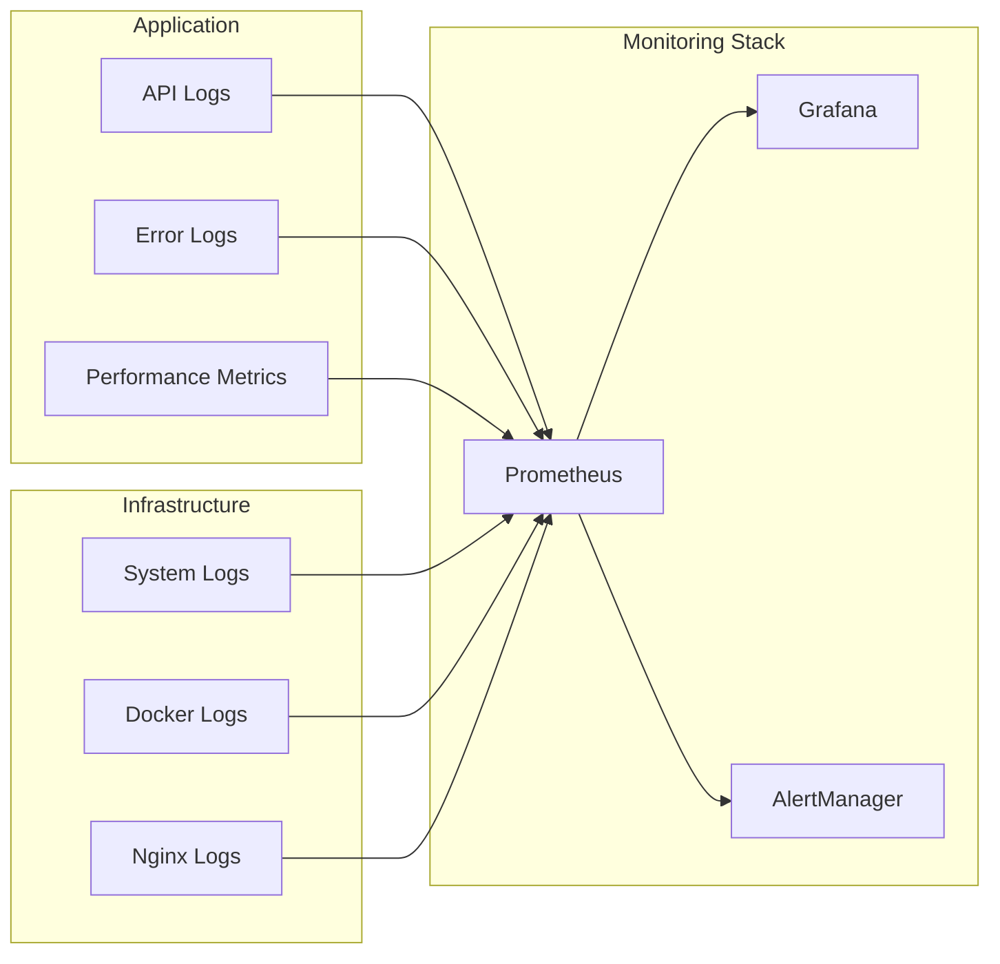
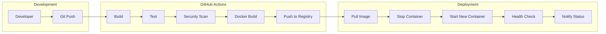

# GitHub Discord Notifier アーキテクチャ図

## 1. システム全体アーキテクチャ



## 2. レイヤードアーキテクチャ詳細



## 3. .NET 8 プロジェクト構造

```
GitHubDiscordNotifier/
├── src/
│   ├── GitHubDiscordNotifier.Api/          # Web API プロジェクト
│   │   ├── Controllers/
│   │   │   ├── AuthController.cs
│   │   │   ├── SystemsController.cs
│   │   │   ├── RepositoriesController.cs
│   │   │   ├── NotificationsController.cs
│   │   │   └── WebhookController.cs
│   │   ├── Middleware/
│   │   │   ├── ErrorHandlingMiddleware.cs
│   │   │   ├── JwtMiddleware.cs
│   │   │   └── RateLimitingMiddleware.cs
│   │   ├── Filters/
│   │   │   └── AuthorizeAttribute.cs
│   │   ├── Program.cs
│   │   └── appsettings.json
│   │
│   ├── GitHubDiscordNotifier.Application/  # アプリケーション層
│   │   ├── Common/
│   │   │   ├── Interfaces/
│   │   │   ├── Mappings/
│   │   │   └── Behaviours/
│   │   ├── Auth/
│   │   │   ├── Commands/
│   │   │   ├── Queries/
│   │   │   └── DTOs/
│   │   ├── Systems/
│   │   │   ├── Commands/
│   │   │   ├── Queries/
│   │   │   └── DTOs/
│   │   └── Notifications/
│   │       ├── Commands/
│   │       ├── Queries/
│   │       └── DTOs/
│   │
│   ├── GitHubDiscordNotifier.Domain/       # ドメイン層
│   │   ├── Entities/
│   │   │   ├── User.cs
│   │   │   ├── System.cs
│   │   │   ├── SystemMember.cs
│   │   │   ├── Repository.cs
│   │   │   └── NotificationChannel.cs
│   │   ├── ValueObjects/
│   │   │   ├── Email.cs
│   │   │   ├── Role.cs
│   │   │   └── WebhookSecret.cs
│   │   ├── Interfaces/
│   │   │   ├── IUserRepository.cs
│   │   │   ├── ISystemRepository.cs
│   │   │   └── IUnitOfWork.cs
│   │   └── Events/
│   │       └── DomainEvents.cs
│   │
│   ├── GitHubDiscordNotifier.Infrastructure/ # インフラ層
│   │   ├── Persistence/
│   │   │   ├── NotifierDbContext.cs
│   │   │   ├── Configurations/
│   │   │   ├── Repositories/
│   │   │   └── Migrations/
│   │   ├── Services/
│   │   │   ├── DiscordService.cs
│   │   │   ├── EmailService.cs
│   │   │   ├── JwtService.cs
│   │   │   └── CacheService.cs
│   │   └── DependencyInjection.cs
│   │
│   └── GitHubDiscordNotifier.Tests/       # テストプロジェクト
│       ├── Unit/
│       ├── Integration/
│       └── E2E/
│
├── frontend/                               # Vue.jsフロントエンド
├── docker-compose.yml
├── .github/workflows/
└── README.md
```

## 4. データフロー図



## 5. デプロイメントアーキテクチャ



## 6. セキュリティアーキテクチャ



## 7. スケーラビリティ考慮事項

### 7.1 水平スケーリング対応
- ステートレスなAPI設計
- Redisによるセッション管理
- ロードバランサー対応設計

### 7.2 パフォーマンス最適化
- 非同期処理（async/await）
- キャッシュ戦略
- データベースインデックス最適化
- N+1問題の回避

### 7.3 可用性
- ヘルスチェックエンドポイント
- グレースフルシャットダウン
- 自動リスタート設定
- バックアップ戦略

## 8. 監視とロギング



## 9. CI/CDパイプライン



## 10. 技術選定理由

### 10.1 .NET 8を選択した理由
- 最新のLTS版で長期サポート
- 優れたパフォーマンス
- クロスプラットフォーム対応
- 豊富なエコシステム

### 10.2 PostgreSQLを選択した理由
- オープンソース
- JSON型サポート（通知設定保存に活用）
- 高い信頼性とパフォーマンス
- Entity Framework Coreとの相性

### 10.3 Redisを選択した理由
- 高速なキャッシュ
- セッション管理
- リアルタイム機能の実装基盤
- Pub/Sub機能

### 10.4 Vue.js 3を選択した理由
- Composition APIによる型安全性
- 軽量で高速
- 豊富なエコシステム
- 学習曲線が緩やか