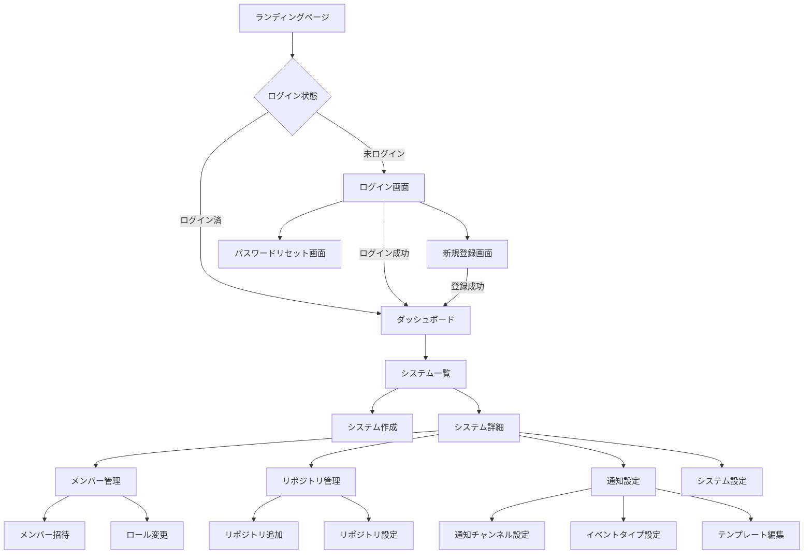

# GitHub Discord Notifier 画面フロー図

## 1. 画面フロー概要

## 2. 画面詳細

### 2.1 認証関連画面

#### ランディングページ (/)
- サービス説明
- 機能紹介
- 料金プラン（将来的に）
- ログイン/新規登録ボタン

#### ログイン画面 (/login)
- メールアドレス入力
- パスワード入力
- 「ログイン」ボタン
- 「新規登録」リンク
- 「パスワードを忘れた方」リンク

#### 新規登録画面 (/register)
- メールアドレス入力
- パスワード入力（要件表示）
- パスワード確認入力
- 利用規約同意チェックボックス
- 「登録」ボタン

#### パスワードリセット画面 (/reset-password)
- メールアドレス入力
- 「リセットメール送信」ボタン

### 2.2 メイン画面

#### ダッシュボード (/dashboard)
- システム一覧カード表示
  - システム名
  - 説明
  - メンバー数
  - リポジトリ数
  - 最終通知日時
- 「新規システム作成」ボタン
- ユーザープロフィール（右上）

#### システム作成画面 (/systems/new)
- システム名入力
- 説明入力（オプション）
- Discord サーバーID入力
- Discord Bot トークン入力
- 「作成」ボタン
- 「キャンセル」ボタン

#### システム詳細画面 (/systems/:id)
- タブ切り替え
  - 概要
  - メンバー
  - リポジトリ
  - 通知設定
  - 設定
- システム統計情報
  - 総通知数
  - アクティブリポジトリ数
  - メンバー数

### 2.3 管理画面

#### メンバー管理画面 (/systems/:id/members)
- メンバー一覧テーブル
  - アバター
  - 名前
  - メールアドレス
  - ロール
  - 参加日
  - アクション（ロール変更/削除）
- 「メンバー招待」ボタン
- 検索/フィルター機能

#### メンバー招待モーダル
- メールアドレス入力（複数可）
- ロール選択
- 招待メッセージ（オプション）
- 「招待送信」ボタン

#### リポジトリ管理画面 (/systems/:id/repositories)
- リポジトリ一覧
  - リポジトリ名
  - URL
  - 追加者
  - 追加日
  - ステータス（アクティブ/非アクティブ）
  - アクション（設定/削除）
- 「リポジトリ追加」ボタン

#### リポジトリ追加モーダル
- GitHub リポジトリURL入力
- または リポジトリ検索
- Webhook Secret 自動生成/表示
- 「追加」ボタン

#### 通知設定画面 (/systems/:id/notifications)
- 通知チャンネル一覧
  - リポジトリ
  - Discord チャンネル
  - イベントタイプ
  - テンプレート
  - ステータス
  - アクション（編集/削除）
- 「通知設定追加」ボタン

#### 通知設定編集モーダル
- リポジトリ選択
- Discord チャンネル選択
- イベントタイプ選択（チェックボックス）
  - Push
  - Pull Request
  - Issues
  - Releases
  - その他
- テンプレート編集（エディタ）
- プレビュー機能
- 「保存」ボタン

#### システム設定画面 (/systems/:id/settings)
- 基本情報編集
  - システム名
  - 説明
- Discord 設定
  - サーバーID
  - Bot トークン
  - 接続テスト
- 危険な操作
  - システム削除ボタン（確認ダイアログ付き）

### 2.4 ユーザー設定画面

#### プロフィール画面 (/profile)
- 基本情報
  - 名前
  - メールアドレス
  - アバター（GitHub連携時）
- GitHub 連携
  - 連携状態表示
  - 連携/解除ボタン
- セキュリティ
  - パスワード変更
  - 二要素認証（将来実装）

## 3. 画面遷移の特徴

### 3.1 認証ガード
- 未ログインユーザーは認証が必要な画面にアクセスするとログイン画面へリダイレクト
- ログイン後は元のURLへ自動遷移

### 3.2 権限チェック
- システムメンバーでない場合はアクセス拒否
- ロールに応じて表示/操作可能な機能を制限

### 3.3 レスポンシブデザイン
- モバイル対応
- タブレット対応
- デスクトップ最適化

### 3.4 リアルタイム更新
- 通知設定の変更は即座に反映
- メンバーの追加/削除もリアルタイム同期

## 4. UI/UXガイドライン

### 4.1 デザインシステム
- カラーパレット
  - Primary: #5865F2 (Discord風)
  - Secondary: #0366D6 (GitHub風)
  - Success: #28A745
  - Warning: #FFC107
  - Error: #DC3545

### 4.2 コンポーネント
- ボタン: 角丸、シャドウ付き
- カード: 白背景、軽いシャドウ
- フォーム: ラベル付き、エラー表示
- モーダル: オーバーレイ、アニメーション

### 4.3 アクセシビリティ
- キーボードナビゲーション対応
- スクリーンリーダー対応
- コントラスト比準拠
- フォーカス表示

### 4.4 パフォーマンス
- 遅延ローディング
- 無限スクロール（大量データ時）
- キャッシュ活用
- 最適化された画像