# GitHub Discord Notifier シーケンス図

## 1. ユーザー認証フロー

### 1.1 新規登録

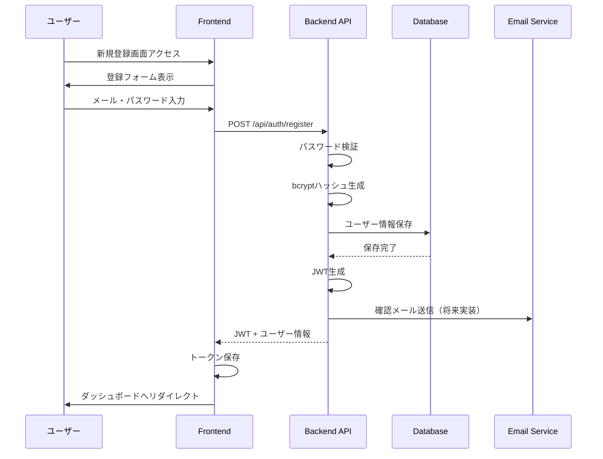

### 1.2 ログイン

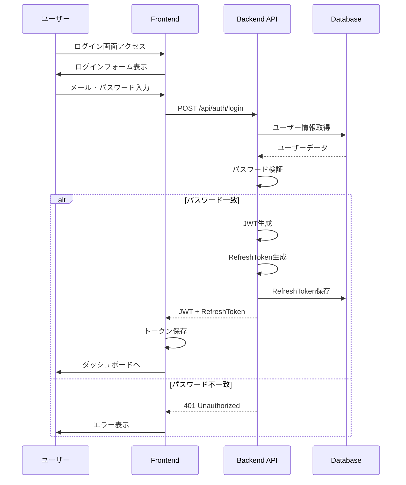

## 2. システム管理フロー

### 2.1 システム作成

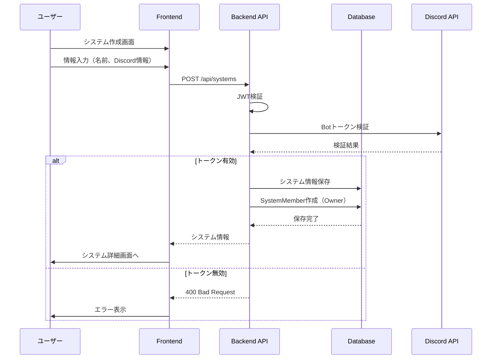

### 2.2 メンバー招待

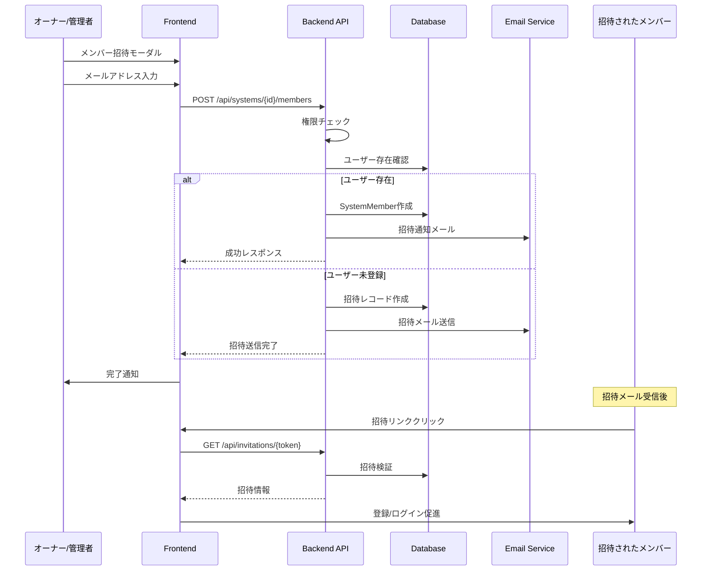

## 3. GitHub連携フロー

### 3.1 リポジトリ追加とWebhook設定

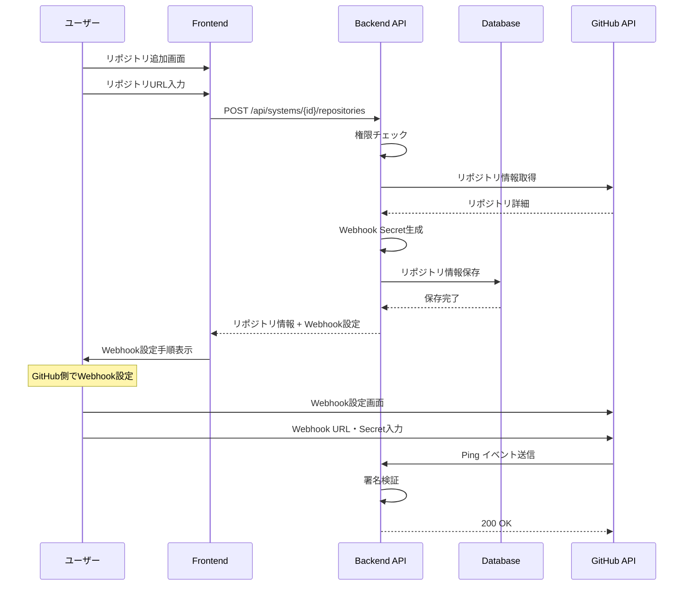

### 3.2 GitHub Webhook受信

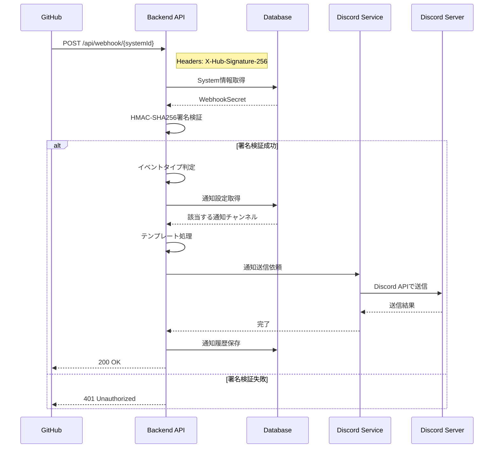

## 4. Discord通知フロー

### 4.1 通知設定作成

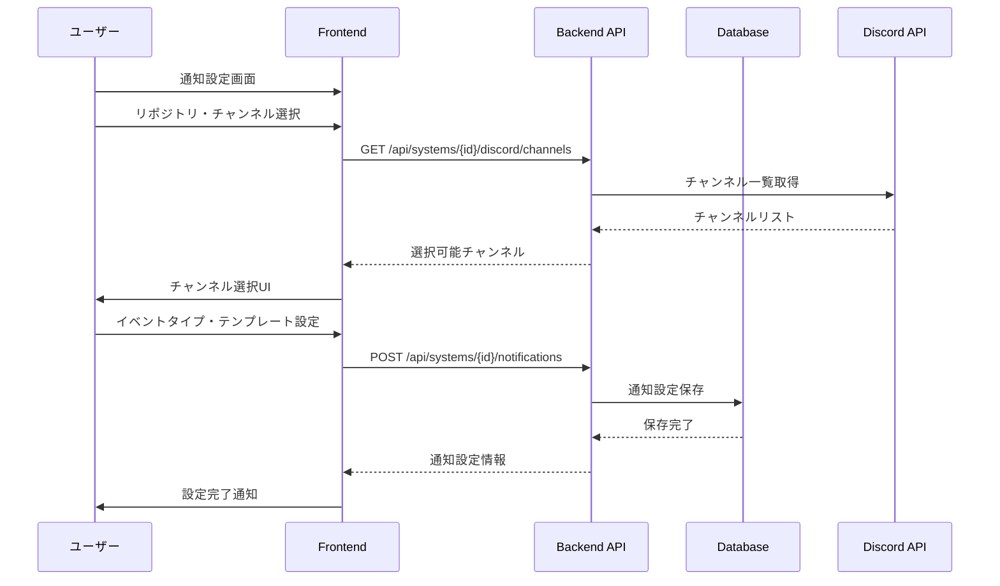

### 4.2 カスタムテンプレート処理

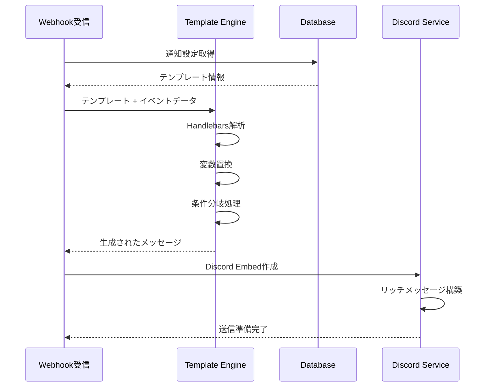

## 5. エラーハンドリングフロー

### 5.1 API エラー処理

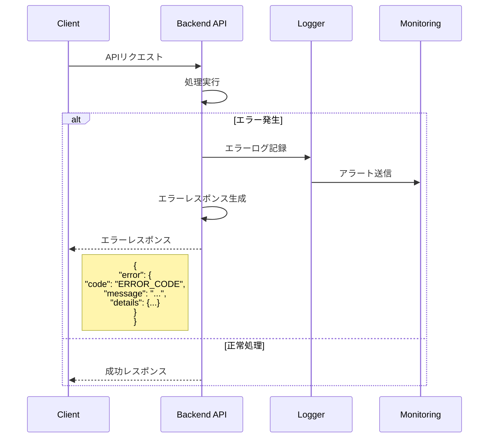

### 5.2 Discord送信失敗時のリトライ

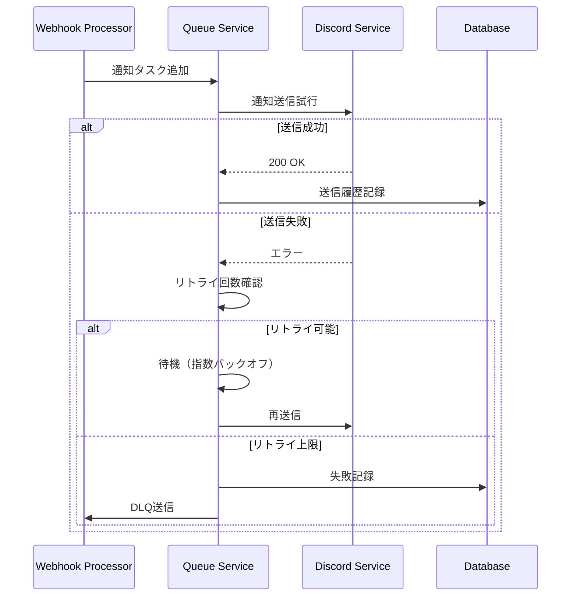

## 6. 認証トークン更新フロー

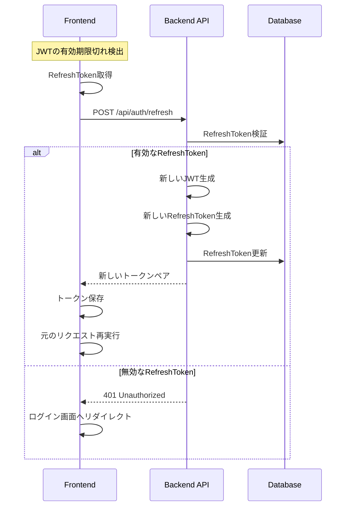

## 7. システム削除フロー

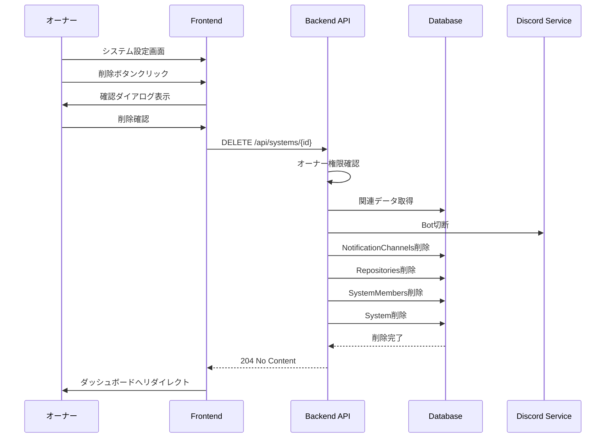